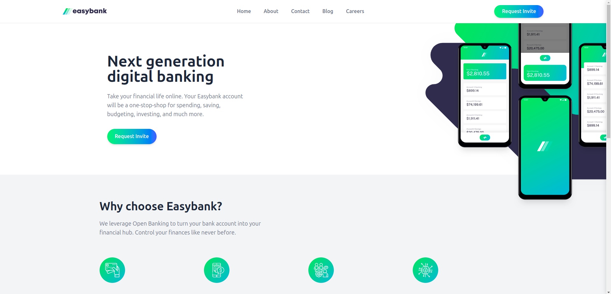
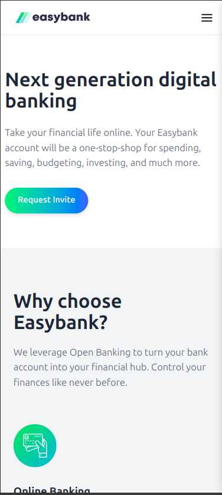

# 💳 EasyBank - Landing Page

A modern, clean, and fully responsive **bank landing page** built using **React** and **TailwindCSS**. Perfect for showcasing your design and frontend skills. This project simulates the homepage of a fictional digital bank and is ideal for portfolios and frontend practice.

---

## 🖥️ Live Demo

### 💻 Desktop View  


### 📱 Mobile View  


> Place your screenshots inside a `demo/` folder at the root level.

---

## 🧰 Tech Stack

- ⚛️ **React** – UI library for building components  
- 💨 **TailwindCSS** – Utility-first CSS framework for fast styling  
- ⚡ **Vite** *(or CRA)* – Lightning fast dev environment (adjust as needed)  
- 🌐 **Responsive Design** – Mobile-first with Tailwind breakpoints  

---

## 📦 Installation

Clone the project and install dependencies:

```bash
git clone https://github.com/your-username/landing-page.git
cd landing-page
npm install
npm run dev